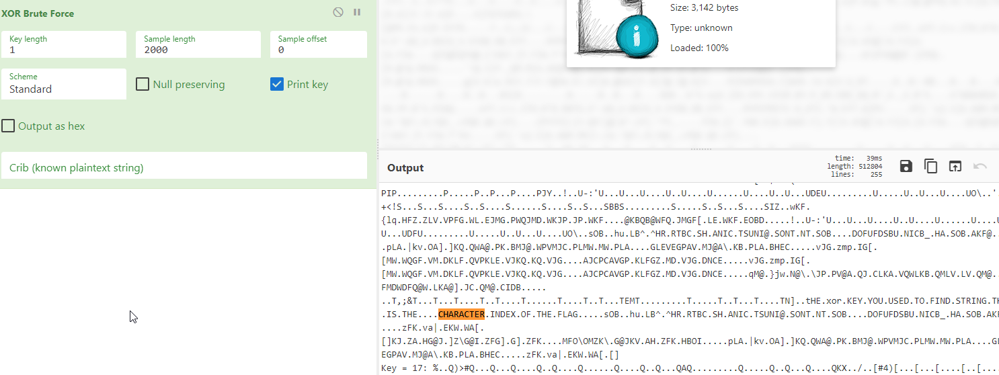

Credits for this soltion to Challenge to Trixie

This challenge deals with XOR putting this into Cyberchef we can see that its printing the character index for each key we use , and i tested this at first with Cyberchef and CTRL+F the word challenge and we can find character indexes. 

So we can make a script to find all these Character Indexes and then combine the hex value of the string and convert those hex to text and we get our flag.