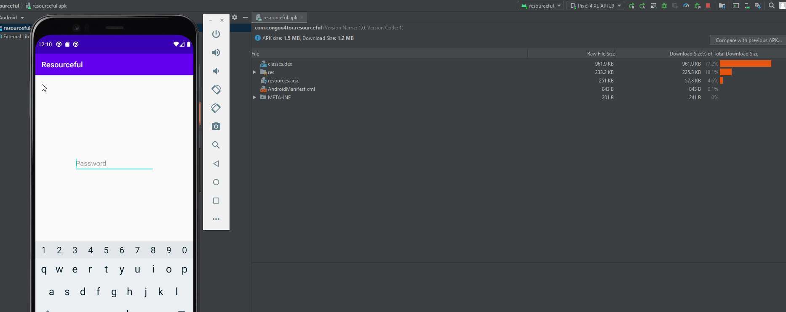
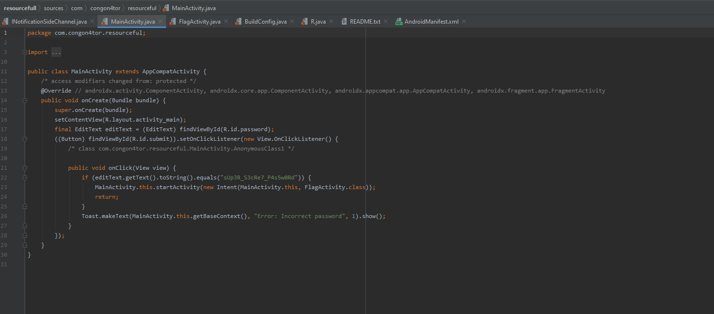
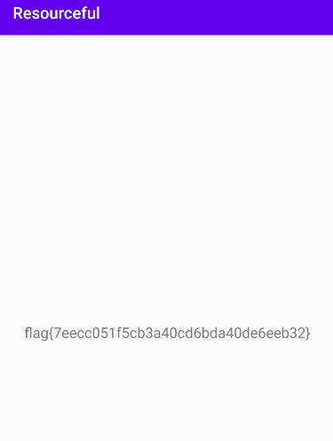

### Resourcefull

This is a super basic Andorid Challenge for which i used Andoid Studio to Emulate a Phone and then https://www.apkdecompilers.com/ to decompoile the code and analyse it in Android Studio if you open the apk in Andorid Studio via profile/debug an APK file you will get such a screen on your Virtual Phone.

And then we can use the site above website we will get the decompiled Java code for this application and traversing to the /sources/com/congon4tor/resourceful/MainActivity.Java file we will see the password :

and entering this password in the virtualphone we can get the Flag.

